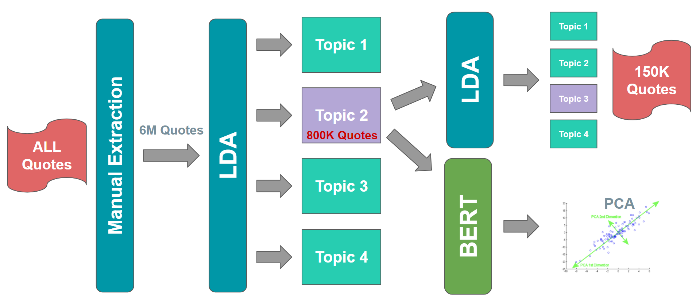
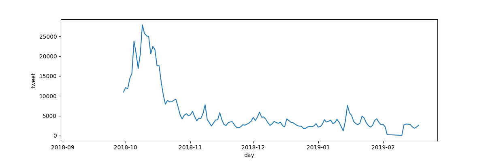
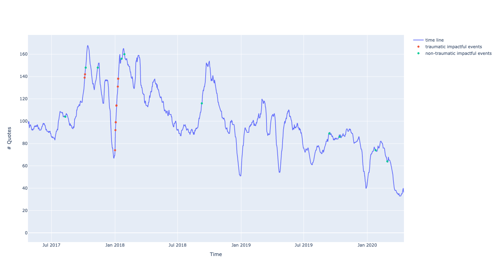

# Movement Resurection

## Abstract

Social and human rights movements usually gain popularity following traumatic events e.g: #BlackLivesMatter was founded in 2013 but gained popularity in 2020 after Floyd’s death. However, non-traumatic events can also act as catalysts for such movements e.g.: Bombshell movie in 2019 opened a conversation about sexual harassment and revived the #metoo movement (originally founded in 2006).

Our goal is to build a timeline of the #metoo movement to analyze the influence of (non-)traumatic events on this movement throughout the years, using the Quotebank dataset and twitter dataset as a proxy for measuring impact. This will be implemented by extracting quotes/tweets relevant to #metoo movement over time. Then, construct two timelines, one for traumatic events and another one for non-traumatic events. Finally, we use these timelines to apply statistical/inference analyses to study the occurrence of (non-)traumatic events with changes in quotes/tweets related to #metoo.

## Research questions

1. Can we extract quotes related to MeToo movement or Sexual Harassment in the workplace from Quotebank 2015-2020?
2. Is there a gender bias in the speakers of quotes related to sexual harassment ?
3. What is the impact of the traumatic vs non-traumatic events on the MeToo movement, based on quotes and tweets involved in #MeToo?
4. Can we observe cancel culture as a ramification of the #MeToo movement?

## Proposed additional datasets
In addition to Quotebank dataset, we'll be using :

### Dataset 1 : Metoo tweets
The tweets dataset is acquired from [Harvard Dataverse](https://dataverse.harvard.edu/dataset.xhtml?persistentId=doi:10.7910/DVN/2SRSKJ) which contains 32,071,469 *#metoo* tweets ranging from October 15 2017 to March 31 2020. The dataset only contains tweet IDs, thus, we applied for access to Twitter API in order to fetch tweets and their metadata from IDs. The dataset is distributed in 33 txt files *(each containing 1M tweet IDs)*.

### Dataset 2 : Traumatic Events 
The history of #metoo has been defined by waves of popularity in the public discourse. These were caused by events that ignited strong feelings and heated discussions into the mainstream, posing a challenge to the status quo of powerful men used to having their ways. In this context, we define traumatic events as the ones related to the core issue of sexual harassment, the allegations by victims and direct consequences.
After several unsuccessful tries using wikidata platform, we abandonned this as a primary source of information as the criteria of inclusion "wikidata item has a specific property" did not appear to be strong enough to base our analysis on. We then looked at the literature to check how these analyses were carried out in published research. In both [Ghosh 2020](https://journals.sagepub.com/doi/abs/10.1177/1940161220968081) and [Kaufman 2021](https://journals.sagepub.com/doi/abs/10.1177/0886260519868197), the considered events were seemingly picked from the news of the studied period. We set off to do the same. In our final list of traumatic events, we will therefore present a selection of allegations of sexual misconduct extracted from the previously mentioned papers, integrated with more updated lists such as [List](https://www.vox.com/a/sexual-harassment-assault-allegations-list?).

### Dataset 3 : Non-Traumatic Events
This dataset aims to cense events which are not related to the core issue of sexual harassment and consequences. After unsuccessful trials to find datasets providing such events, we decided to manually build our own based on articles/blogs such as the [MeToo info page](metoomvmt.org), [ChicagoTribune - #Metoo events timeline](https://www.chicagotribune.com/lifestyles/ct-me-too-timeline-20171208-htmlstory.htmlrelating), [Deutsche Welle]( https://www.dw.com/en/one-year-of-metoo-a-timeline-of-events/a-45763400) the importance of certain events (movie release/publications/demonstrations, and others..) related to MeToo from 2015-2020. Included events are chosen based on their occurrence in at least two sites.

## Methods
### 1. Data extraction 
The phase includes extracting the needed quotes from the original datasets through the use of four methods, applied in the sequential method :
 1. Manual Extraction/WordCloud,
 2. NLP-based Methods (LDA) for topic detection,
 3. BERT / Glove / Word2vec to extract embeddings,
 4. PCA / t-SNE for dimensionality reduction.
All details and some results concerning each method are illustrated in *notebook.ipynb*.

 

### 2. Timeline Implementation and Impact measurements of traumatic and non-traumatic events on #metoo timeline.
We aim at creating a certain timeline displaying the amount of #metoo quotes released by day. This will be implemented from Quotebank extracted quotes, tweets, while displaying the dramatic events on the same timeline. A scheme of the expected timeline shown below.

| Tweets Timeline | Quotebank Timeline with events |
|:------:|:------:|
 | 

The measurement of the impact of all considered events will be carried out with the methods described in the *notebook.ipynb*. We plan to measure the before-after difference in coverage related to each event, exploit the peaks in the derivative associated with surges in media interest.
Afterwards, we will analyze the distributions and compare the impacts of traumatic vs non traumatic events.

### 3. Statistical investigations over gender bias in the Quotebank and Metadata.

We will investigate the presence of a gender bias in Quotebank dataset and compare with in the #metoo extracted quotes dataset. we hypothesize to find a gender bias towards men in Quotebank and find a decrease of this bias in the #metoo quotes.

### 4. Statistical Analysis on Cancel Culture. 

We will use statistical tool (t-test) to invetigate whether we are able to identify a cancel culture based on the quotes spoken by  people accused of sexual misconduct or harassment, and quotes in which those people are mentionned. We expect to find a decrease in the number of quotes (spoken by or mentionning them) after their conviction.

## Proposed Organisation Timeline
Our planning for the coming weeks consists of the following steps: 
 - 15-21 November: Finish polishing the Datasets as well as selecting the appropriate statistical test to determine on which dates there is a significant increase in the number of quotes and tweets. 
 -  21-28 November: Start working on the website and perform the actual statistical analysis.
 -  29 November-5 December: Interpret results from statistical analysis and start the website. 
 -  6-12 December: Fix final problems and (given enough time) perform alternative analysis (see end of **research questions**).
 -  13-17 December:  Polish website and finish all other deliverables.

## Team Organization

- Gasser: Polishing datasets and main person in charge of preprocessing.
- William: Focus on making the website, preprocessing and results visualization.
- Mathias: Help with website, complete the dataset for non-traumatic events, in charge of cancel culture investigations.
- Milo: Determining optimal statistical test and performing impact measurements and vizualisations.

